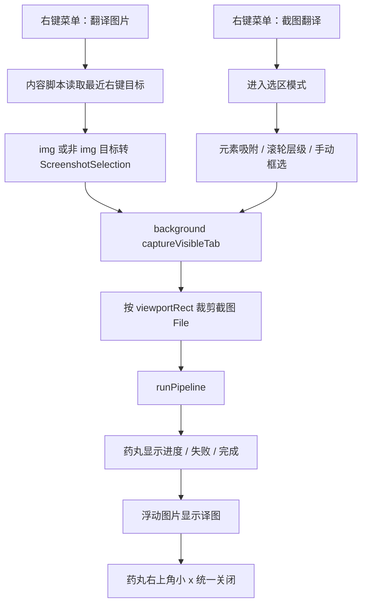

# 技术设计：优化截图翻译选区与药丸状态

## 架构边界

本任务只改内容脚本侧的截图选择、右键入口和结果呈现。后台截图捕获、pipeline 执行和站点适配器自动药丸保持现有边界。

- `src/content/core/screenshot.ts`
  - 保留截图矩形、文档坐标转换和裁剪工具。
  - 新增元素候选、候选矩形、层级索引切换等可测试纯函数。
  - 不直接操作 DOM 事件，不负责 UI 渲染。
- `src/content/core/ui.ts`
  - 继续通过 imperative DOM 创建和渲染 UI。
  - 截图选择 UI 改为弱遮罩 + 元素/手动矩形高亮，移除顶部提示和独立取消按钮。
  - 截图结果 UI 改为“药丸控制器 + 药丸右上角小 x + 浮动图片”的组合组件。
  - 复用现有药丸按钮结构，避免为截图状态另造一套状态 UI。
- `src/content/core/TranslatorCore.ts`
  - 负责截图翻译生命周期：接收选区、截图、裁剪、跑 pipeline、渲染结果、关闭清理。
  - 将截图翻译暴露为 `translateScreenshotSelection(selection)`，供截图菜单和右键“翻译图片”复用。
- `src/content/index.ts`
  - 记录最近一次右键位置和元素。
  - 将 `img` 与非 `img` 目标统一转换成 `ScreenshotSelection`。
  - 右键“翻译图片”调用截图浮动结果流程，不调用旧的原图替换流程。
- `src/background/index.ts`
  - 同时注册“翻译图片”和“截图翻译”，并让“翻译图片”在 `all` context 下可见。

## 数据流

## 选区契约

`requestScreenshotSelection()` 返回 `ScreenshotSelection | null`，内部来源分为两类：

- 自动元素选区：基于 `document.elementsFromPoint(clientX, clientY)` 和父链得到候选列表，过滤截图 UI 自身、不可见元素、过小元素和全页面噪声元素后，默认选择最贴近鼠标的较小可见元素。
- 手动矩形选区：按住左键拖动后使用 `normalizeScreenshotRect()` 生成矩形，并在释放时转换成文档坐标。

滚轮层级切换只作用于自动元素选区。手动拖拽一旦开始，本次选择使用拖拽矩形，不再跟随元素候选。

自动点击或手动拖拽松手后不直接返回 selection，而是进入 `confirming` 阶段：

- 选区框显示超粗深灰线，颜色参考药丸描边，外侧没有白色描边；CSS 可给边框轻微圆角，但 selection 数据仍是方形 `ScreenshotRect`。
- 选区附近显示亮色药丸工具条，内部是两个紧凑圆形图标按钮：lucide 风格对勾确认、叉号重新框选；按钮圆圈 hover 时加深。
- 拖动边角/边缘热区调整大小；热区保持可交互但不显示圆形手柄，范围覆盖深灰粗描边并向外留少量余量，拖动选区内部可移动选区。
- 双击选区内部等同于点击确认。
- 叉号只回到重新框选，不关闭整个截图 overlay；`Esc` 仍取消整个截图流程。

## 右键翻译契约

右键“翻译图片”不再有“原图替换”分支：

- 如果右键目标是 `HTMLImageElement`，使用该图片元素的可视矩形生成 `ScreenshotSelection`。
- 如果右键目标不是 `img`，从右键事件的 composed path 与 `elementsFromPoint()` 收集候选元素，选择合适元素矩形生成 `ScreenshotSelection`。
- 生成选区后统一调用 `TranslatorCore.translateScreenshotSelection(selection)`。
- 如果无法得到有效选区，返回中文错误 `未找到可翻译区域`。

站点适配器自动发现图片并挂载的药丸仍然调用 `adapter.applyImage()`，保留原地替换能力。右键菜单入口只承担临时区域截图翻译。

## 结果组件契约

截图结果不再是“图片框 + 内部状态文字 + 图片角落关闭按钮”。它是一个组合：

- `host`：绝对定位的结果组，承载拖动和生命周期。
- `pillUi`：复用药丸按钮结构，显示运行状态、成功后的“显示原图/显示译图”、失败后的“重试”。
- `closeButton`：药丸右上角小圆形 `x`，只负责关闭整个结果组。
- `image`：翻译成功后显示，跟随 `host` 移动和移除。
- `host::before`：截图前或尚无原图 object URL 时显示同尺寸占位，复用完成态图片的边框/投影语汇。
- `image` 在运行和失败期间优先显示裁剪后的原图，在成功后显示译图；切换原图/译图仍复用同一个 ``，形成原图到译图的视觉连续性。

失败时沿用现有药丸语义：按钮显示重试，详情通过原有 detail line 表达。不新增红色浮层提示。

成功态的 detail line 只在存在 `elapsedText` 时显示，避免未开启耗时/调试选项时出现额外的“翻译完成”小字。错误态仍显示错误详情。

截图前需要先绘制一帧占位，再短暂隐藏整个结果组并等待下一帧后调用 `mt:capture-visible-tab`，避免覆盖层被截进源图。裁剪完成并创建原图 object URL 后立即重新渲染，让运行态显示原图。

## 样式约束

- 所有截图相关 class 继续使用 `mt-x-` 前缀。
- 选区层保留高 z-index，非选中区域使用更暗遮罩增强对比。
- 选区边界使用超粗深灰线，不使用白色外描边；圆角只是视觉修饰，不改变裁剪矩形。
- 不显示顶部提示，不显示独立取消按钮。
- 药丸关闭小 `x` 视觉上附着在药丸右上角，而不是图片右上角。
- 药丸小 `x` 不使用阴影，使用 lucide 风格 SVG，尺寸和图标占比都比原版更小，更贴近药丸本体；图标颜色使用选区描边深灰，按钮参考药丸本体配色，hover 时整颗按钮叠加暗色。

## 兼容性与风险

- `elementsFromPoint()` 在普通网页中可用，但不同站点 DOM 包装层级很深，需要过滤扩展 UI 和无意义全屏容器。
- 截图 UI 覆盖页面后可能影响 `elementsFromPoint()`，实现时需要通过 pointer-events 和过滤策略确保候选来自页面内容。
- 页面滚动期间的 `documentRect` 以确认时的 `window.scrollX/Y` 计算，裁剪仍使用 `viewportRect`。
- 右键翻译复用截图浮动结果流程，因此关闭时必须复用同一套 object URL 清理路径。
