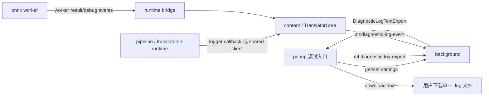

# 构建结构化日志系统 - 技术设计

## Architecture

新增一个轻量的本地日志子系统，不接入远程 telemetry。核心由三层组成：

1. `src/shared/diagnosticLog.ts`
   - 定义日志事件 schema、日志包 schema、等级、分类、脱敏工具、runId/sessionId 生成。
   - 只包含可被 content、popup、background、pipeline 共享的纯 TypeScript 类型和工具。

2. `src/shared/diagnosticLogClient.ts` 或同等模块
   - 提供 `logEvent`、`startRun`、`finishRun`、`captureError` 等轻量 API。
   - 在 content / popup 中通过 runtime message 将事件发送给 background。
   - 在 background 中直接写入内存环形缓冲，并按需落到 `chrome.storage.local`。

3. background 日志仓库
   - background service worker 作为统一日志汇聚点。
   - 保存最近若干个 run 的事件和摘要，限制总事件数和 JSON 体积，避免无限增长。
   - 响应 popup 的 `mt:diagnostic-log-export` 消息，返回由内部事件派生的 `.log` 文本。

## Data Flow



## Event Schema

建议事件格式：

```ts
type DiagnosticLogEvent = {
  id: string;
  runId?: string;
  sessionId: string;
  timestamp: string;
  level: 'debug' | 'info' | 'warn' | 'error';
  category:
    | 'app.config'
    | 'runtime.message'
    | 'pipeline.stage'
    | 'model.runtime'
    | 'pipeline.detect'
    | 'pipeline.ocr'
    | 'pipeline.inpaint'
    | 'pipeline.typeset'
    | 'llm.api'
    | 'image.io'
    | 'chrome.api'
    | 'ui.perf'
    | 'error';
  source: {
    context: 'popup' | 'content' | 'background' | 'worker';
    module?: string;
  };
  message: string;
  data?: Record<string, unknown>;
  error?: {
    name?: string;
    message: string;
    stack?: string;
    cause?: unknown;
  };
};
```

popup 默认导出格式：

```ts
type DiagnosticLogTextExport = {
  schemaVersion: 1;
  exportedAt: string;
  filenamePrefix: 'shinobu-diagnostic-log';
  contentType: 'text/plain;charset=utf-8';
  eventCount: number;
  text: string;
};
```

`events` 只保存在 background 的内部 storage 中，作为生成文本日志的中间表示；默认下载不暴露顶层 `events` 数组。

## Readable Log Format

导出内容必须是由结构化事件派生的 `.log` 文本，面向人工阅读。单行格式：

```text
[2026-06-27 17:28:22.875][ERR][content][run-c6866ff1][llm.api] translators/llm.ts | DeepSeek 请求失败 error="Failed to fetch" {"provider":"deepseek","endpoint":"https://api.deepseek.com/chat/completions"}
```

格式规则：

- 等级使用 `TRC`、`INF`、`WRN`、`ERR`，贴近 native app 日志风格。
- 时间使用本地时间，格式为 `YYYY-MM-DD HH:mm:ss.SSS`。
- 固定前缀依次包含 context、runId、category，便于 grep。
- `module` 来自 `event.source.module`；缺失时用 `event.category`。
- `message` 是脱敏后的用户可读摘要。
- `event.data` / `event.error` 以单行紧凑 JSON 追加在同一行末尾；长文本仍先统一脱敏和截断。
- 文本日志由 `events` 生成，不单独维护，防止两套日志不一致。

## Unified Download Entry

popup 作为唯一下载入口：

- 在“调试选项”中保留“日志记录”开关。
- 增加或替换为一个“下载日志”按钮，按钮调用 background export message 并下载 `.log` 文本。
- 清空历史日志也放在同一个 popup 调试按钮组，调用 background clear message，不提供散落入口。
- content 图片 UI 里的旧“下载日志”按钮不再导出独立 typeset log；可选择隐藏，或改为触发同一统一导出流程，但产品要求以 popup 为主入口。
- 现有 `typeset-debug-log` 文件名应迁移为统一前缀，例如 `shinobu-diagnostic-log-<timestamp>.log`。

## LLM API Logging

DeepSeek 问题的关键在 `src/translators/llm.ts` 的 content 直连 fetch：

- 请求开始事件：provider、authMode、model、sanitized endpoint、request body 大小、message 数量、是否要求 JSON response format。
- 请求结束事件：HTTP status、ok、content-type、耗时、响应体大小、解析状态。
- 请求失败事件：错误 name/message、是否 AbortError、是否 TypeError / `Failed to fetch`、是否发生在 content 直连、可能原因标签。
- 永远不记录 Authorization 明文。endpoint 允许记录 origin + path，不记录 query secret。
- prompt 和 raw response 默认允许进入统一日志包，但必须先脱敏，并对超长文本做截断；截断时记录原始长度和 `truncated: true`。

对 OpenAI OAuth、Gemini App、Gemini API 图像翻译的 background 请求，也应在 background 侧写入同一 `llm.api` 分类。

## Pipeline And Model Logging

pipeline 不应该到处直接 `console.warn`。实现上可先通过小步替换：

- `runPipeline` 创建 run，记录每个 stage start/end/fail。
- 将已有 `stageTimings`、`runtimeStages`、`translationDebug`、`ocrDebug`、`typesetDebugLog`、`progressJank` 作为 artifacts 或摘要挂入日志包。
- detector / OCR / inpaint / ONNX fallback 先记录结构化 warn 事件，再保留必要 console 输出用于开发调试。
- worker 侧若不能直接访问 runtime message，则通过 worker response/debug 字段传给 runtime bridge，再写入日志。

## Persistence And Size Limits

- background 内存保存最近 N 个 run 和全局事件。
- `chrome.storage.local` 保存最新日志包或最近失败 run，保证 service worker 生命周期结束后 popup 仍可导出。
- 默认限制：最近 5 个 run、最多 1000-2000 条事件、单事件 data 做裁剪、大型文本字段按配置截断。
- 导出时附带 `truncated: true` 和截断原因，避免误判。

## Redaction

必须统一脱敏：

- 移除或替换 `apiKey`、`Authorization`、`cookie`、`token`、`access_token`、`refresh_token`、OAuth code、Bearer header。
- 对 settings snapshot 只保留 provider、model、authMode、baseUrl、目标语言、processMode、debug 开关等。
- 对 URL 保留 origin/path/status，谨慎处理 query。
- 错误 stack 可以记录，但必须先过脱敏函数。
- OCR 原文、大模型 prompt、大模型原始响应允许记录，但需要文本截断和敏感字段脱敏。
- 原图 data URL 默认不写入统一日志包。已有 debug artifact 中的 `sourceImageUrl` 应在合并进统一日志包时改为图片元信息或脱敏引用。

## Compatibility

- 不改变默认行为；`enableDebugLog` 关闭时不保存详细日志。
- 现有 benchmark 和 bake 脚本不应依赖 popup 日志系统。
- 保持 Manifest V3 service worker 兼容，不能依赖长驻 background。
- content script 仍使用 imperative DOM，不引入 React。

## Rollback

该功能可以通过关闭 `enableDebugLog` 退回原行为。实现应把日志系统作为旁路，不让日志失败影响翻译主流程。所有 logging API 必须 best-effort，不向业务路径抛错。
