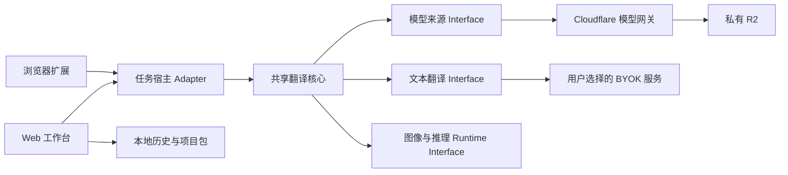

# Shinobu Translator Web 设计文档

> 状态：accepted，实施中。用户已于 2026-07-28 明确确认开始源码实施；当前按文末顺序增量交付。

相关文档：

- [领域词汇](../../../CONTEXT.md)
- [ADR-0002：扩展与 Web 共用一个 monorepo](../../adr/0002-extension-and-web-share-a-monorepo.md)
- [ADR-0003：浏览器拥有图片处理与用户数据](../../adr/0003-browser-owns-processing-and-user-data.md)
- [ADR-0004：模型分发在 Cloudflare 免费额度内 fail-closed](../../adr/0004-model-delivery-fails-closed-on-cloudflare-free.md)

## 背景

Shinobu Translator 当前是 Chrome/Edge Manifest V3 浏览器扩展，已经具备文本检测、气泡检测、日文 OCR、蒙版细化、文字擦除、图片修复和重新排版能力。Web 版本不是另写一套翻译器，而是把现有流水线抽成共享核心，并为本地文件、批量任务、本地历史和 PWA 提供完整网页工作台。

项目是非盈利的 GPL-3.0 开源项目。设计优先级依次是：

1. 用户图片不离开浏览器；
2. 项目部署保持免费且在滥用时停止放量；
3. 扩展与 Web 共用能力并可独立发布；
4. 先保证桌面端稳定，再按设备能力开放移动端；
5. 不引入账户、云同步或企业级运维体系。

## 产品范围

### 包含

- 日文漫画图片翻译为简体中文或繁体中文；
- 单图与有序批量导入；
- “翻译”“原文重排”“仅擦除”三个现有处理模式；
- 浏览器本地视觉推理；
- 用户自备凭据的在线文本翻译；
- 本地历史、任务恢复、结果导出和项目包迁移；
- 桌面工作台、移动端响应式工作台和 PWA；
- Cloudflare Pages、私有 R2 与 Workers Free 模型网关；
- 扩展与 Web 共用核心、配置 Schema、测试语料和模型清单。

### 不包含

- 用户账户、云同步、团队协作或服务端历史；
- 服务端图片处理或项目方提供的共享翻译额度；
- 手工文本框编辑、译文校对器、术语表或自定义提示词；
- 跨图片的大模型上下文；
- 自动分析、用户追踪、成本估算或远程错误上报；
- 动画、多帧图片、SVG、TIFF 或整图上传式翻译；
- Google GTX 等不稳定私有接口、Cookie/OAuth 私有模式或 Nano Banana 整图上传；
- 后台持续推理、后台模型下载或离线启动新任务；
- 企业级 SLA、工单系统、合规认证或独立在线预览环境。

## 品牌、语言与默认值

- 产品名沿用 `Shinobu Translator Web`；
- 界面提供简体中文与繁体中文；
- 首次目标语言跟随界面语言，之后记住用户最后一次选择；
- 首次处理模式为“翻译”，之后记住用户最后一次选择；
- 浅色/深色主题跟随系统；
- 沿用扩展的品牌、色彩与控件语义，但 Web 使用全屏工作台，不照搬扩展 Popup；
- 不显示翻译费用估算，只显示总耗时、当前阶段和运行时信息。

## 核心用户流程

1. 用户导入图片，应用验证格式、尺寸、像素、批次容量和本地空间。
2. 超过当前设备能力档位的图片可生成工作副本；原图保持不变。
3. 用户选择处理模式、目标语言和翻译提供商配置。
4. 用户明确点击“开始”，处理批次配置随即锁定。
5. 图片任务按队列顺序串行执行；运行期间仍可追加、重排或移除尚未开始的任务。
6. 界面显示批次总进度、当前图片阶段和可展开的运行明细。
7. 完成后可比较原图与结果，下载单张 PNG、结果 ZIP 或完整项目包。
8. 历史中的处理批次可以查看、继续或克隆为新批次，但不会原地改写配置。

## 输入与图片语义

### 支持格式

- 静态 PNG、JPEG、WebP、AVIF；
- 系统文件/相册多选、拖放、剪贴板粘贴和系统相机入口；
- 动画 PNG/WebP、GIF、SVG、TIFF、HEIC/HEIF 及其他未验证格式在 MVP 中拒绝；
- 不信任 `File.type`，使用有限头部魔数与尺寸检查，再进行浏览器实际解码。

### 固定安全闸门

| 项目 | 桌面 | 移动 |
| --- | ---: | ---: |
| 单文件 | 32 MiB | 20 MiB |
| 原图绝对像素 | 40 MP，仅允许随后缩小 | 40 MP，仅允许随后缩小 |
| 绝对长边 | 8,192 px，并受 GPU 实际限制约束 | 同左 |
| 工作像素默认值 | 8 MP | 界面同为 8 MP，但必须通过对应能力测试 |
| 工作像素硬上限 | 12 MP | 12 MP 只是绝对上限，不承诺任何手机获得该档位 |
| 单批数量 | 100 张 | 100 张 |
| 单批原文件总量 | 500 MiB | 500 MiB |

实际接收量还要服从本地剩余空间。低内存、调试模式、WASM-only 或能力测试失败的设备会得到更低档位，并要求用户创建工作副本；用户不能绕过安全档位强制启动。

同一时间只允许一张原图处于完整解码、推理和渲染内存中，队列中的其他图片只保存原文件和不超过 512 px 的缩略图。

桌面设备在 `navigator.deviceMemory <= 4` 时初始工作档位降至 6 MP；不提供该信号的设备按 8 MP 起步，再由实际 canary 调整。调试模式的工作像素预算减半。

### 规范化

- 遵循浏览器解码后的 EXIF Orientation，把方向烘焙进工作像素；
- 透明图片的工作副本先铺白，原文件保持不变；
- 工作面统一为 8-bit sRGB；
- 输出为不透明 PNG，不保留 EXIF、GPS、ICC 或其他源文件元数据；
- 下采样不会覆盖原图，界面明确显示工作分辨率和缩放比例。

### 顺序与命名

- 保留选择、拖入和拍摄顺序；
- 允许同一文件重复加入，并显示重复标记；
- 结果 ZIP 使用队列序号加清理后的原文件名，避免重名覆盖。

## 处理与翻译

### 本地流水线

文本检测、气泡检测、日文 OCR、蒙版细化、图片修复和排版全部在浏览器中运行。核心对宿主暴露深接口：

- `run`
- `cancel`
- `progress`
- `result`

共享核心不检测 `chrome`、`window` 或 Cloudflare 环境。模型来源、文本翻译传输和任务宿主均通过明确 Adapter 接入。

Web MVP 前必须先完成以下内存修复：

- 气泡蒙版改为边界框内的单通道局部蒙版；
- 只保留真正匹配到文字区域的气泡蒙版；
- 阶段快照不再深拷贝全尺寸蒙版；
- 像素循环和可迁移的 Canvas 工作移入 Worker；
- 每个阶段及时释放 Canvas、ImageBitmap、Tensor、GPU buffer 和无用 Session；
- 统一处理 WebGPU device lost 与运行期 provider fallback；
- 避免 Session 创建超时后产生并行“幽灵 Session”；
- 移动端关闭并行模型预热。

### 文本翻译

- OCR 固定为日文，目标为简体中文或繁体中文；
- 每张图片使用整页翻译上下文，不跨图片共享上下文；
- 沿用扩展的结构化提示词、思考开关、返回解析和恢复逻辑；
- 内置 DeepSeek、GLM/Z.AI、Kimi/Moonshot、MiniMax、MiMo、OpenAI；
- 每个提供商拥有独立配置，设置页允许切换、编辑和删除配置；
- 支持自定义 OpenAI 兼容配置，包括 Base URL、模型和 API Key；
- 自定义地址允许任意 HTTPS，以及 HTTP loopback：`localhost`、`127.0.0.0/8`、`::1`；
- 不支持普通局域网明文 HTTP；
- 本机服务仍必须满足浏览器 CORS 和本地网络权限要求；
- 首次配置只校验 URL、模型与 API Key 是否完整，不额外发送 CORS 测试请求；
- 应用流程不额外弹出数据外发提示，具体数据边界写入隐私政策。

API Key 默认只保存在当前会话。用户可选择“记住此设备”，此时使用不可导出的 WebCrypto 设备密钥加密后写入本地存储；该措施降低磁盘直读风险，但不宣称能抵御同源应用代码被攻破。Key 绑定规范化后的域名、端口和 API 路径前缀，目标改变后必须重新确认。

### 重试与取消

- 本地单图错误：当前图片失败，批次继续；
- 系统性模型或翻译服务错误：暂停整个批次；
- 网络错误、HTTP 429 和 5xx：最多重试两次并退避；
- 鉴权或 CORS 错误：不自动重试；
- 请求可能已被服务商接收但响应状态未知：由用户决定是否重发；
- “取消当前图片”与“停止整个批次”分开；
- 已完成和待处理任务均保留；
- 改变配置后重跑会克隆为新的处理批次。

## 工作台体验

### 桌面

- 顶部导航；
- 左侧图片队列；
- 中央图片预览；
- 右侧批次配置、进度和错误详情；
- 独立设置页管理提供商配置、API Key、模型、存储、诊断和高级流水线选项；
- 原图/结果滑杆和快速切换；
- 历史按处理批次分组，可展开查看缩略图；
- 错误长期显示在队列与详情中，Toast 只用于瞬时反馈；
- 提供核心流程键盘快捷键。

### 移动

- 底部切换“队列 / 预览 / 任务设置”；
- 固定显示当前进度和开始、暂停操作；
- 相机使用系统捕获入口，不申请持续 `getUserMedia` 权限；
- Android Chrome 作为 Beta，iOS/iPadOS 26+ 作为实验支持；
- 浏览器或设备未通过能力测试时禁用推理，但仍可查看历史、设置和已有结果。

PWA 安装提示在首次成功任务后出现：Android 使用浏览器原生入口，iOS 显示添加到主屏幕步骤；关闭后至少 30 天不再次主动提示，顶部安装入口始终保留。

## 本地历史、PWA 与项目包

### 存储职责

- OPFS：模型、原图、工作副本和大结果 Blob；
- IndexedDB：处理批次索引、状态、OCR、译文、配置、版本与可恢复点；
- Cache Storage：版本化应用外壳、ORT 和字体；
- 翻译 API 请求与响应不进入 Service Worker 缓存。

应用会调用 `storage.estimate()` 和 `persist()`，但不承诺浏览器批准永久存储。历史是本地便利缓存，用户的重要结果必须通过结果 ZIP 或项目包自行备份。

首次模型安装或双版本更新前，估算可用空间至少为 `max(600 MiB, 2 × 模型包 + 100 MiB)`。空间不足时不自动删除历史，而是阻止新导入并提供占用查看、导出和手动清理。

### 历史规则

- 保存原图、结果、配置、状态和时间，不保存 API Key；
- 只由用户手动删除；
- 删除提供短暂撤销，之后清除相关本地数据；
- 支持“只保留结果”，此后该记录不可重跑；
- 浏览器清理或文件损坏时保留仍可访问内容，并标记为部分损坏。

### 离线与生命周期

- 离线时只允许打开应用、查看历史和下载已有结果；
- 即使模型已缓存，也不启动新的翻译、原文重排或擦除任务；
- 页面隐藏后停止领取下一张并保存恢复点；
- 回到前台后重新探测 GPU，必要时重建整个推理 Worker 与 Session；
- 不依赖 `beforeunload`、持续后台执行或 Service Worker 长计算；
- 应用更新在批次空闲后提示激活，旧批次记录应用、核心、模型和配置 Schema 版本。

### 导出与导入

提供两种导出：

1. 结果 ZIP：只含输出 PNG，不能恢复任务；
2. 未加密 `.shinobu.zip` 项目包：含原图、结果、缩略图、OCR、译文、配置、顺序、状态和版本清单，不含模型、API Key 或诊断日志。

每次导出项目包前都要明确列出敏感内容并提示文件未加密。导入时：

- 校验版本化 Manifest、Schema、文件类型、声明大小和 SHA-256；
- 设置单文件和解压总量上限；
- 拒绝路径穿越、HTML、SVG 和未声明文件；
- 先完整校验再原子写入，项目级导入全有或全无；
- 支持的旧 Schema 自动迁移；
- 过新版本拒绝写入，可读但不兼容时只读预览；
- 始终创建新的本地处理批次 ID，不覆盖现有历史。

## 设备能力测试

首次启动任务前执行真实能力测试，而不是仅根据浏览器版本推测：

1. Secure Context、module Worker、OffscreenCanvas、ImageBitmap 传输与目标尺寸 Canvas；
2. OPFS 写读删、配额估算和持久化状态；
3. ORT WASM Session 与最小推理；
4. WebGPU adapter、设备限制、device lost 和自定义 GPU 预处理；
5. 四个模型分别创建 Session 并执行代表性最小输入；
6. 一张合成图片的端到端 canary。

成功结果按浏览器、设备和模型版本缓存；版本变化后重测。失败会降低设备能力档位，不允许用户绕过安全上限。

WASM 多线程需要 COOP/COEP、SharedArrayBuffer 和实际推理通过。WebNN 不作为 Android 或 iOS 的生产默认路径。

## 架构



建议仓库布局：

```text
apps/
  extension/
  web/
  model-gateway/
packages/
  translator-core/
  browser-runtime/
  shared-config/
  shared-ui/
  test-contracts/
```

具体包边界以“深模块、窄接口”为准，不为了目录整齐过度拆包。扩展与 Web 共享设计 Token 和基础控件，不强行共享整体页面。

增量迁移约定：`apps/extension` 拥有扩展的 package、HTML 入口、MV3 manifest、构建配置、版本与发布产物；尚未抽入共享 package 的实现可暂留根 `src`，由扩展 workspace 直接消费。根 package 只编排各 workspace，不再拥有扩展构建产物。

共享配置采用版本化 Schema、默认值和迁移函数。模型来源、翻译传输和任务宿主必须有 Adapter contract tests。

## Cloudflare 部署与模型分发

### 拓扑

- Web：Cloudflare Pages，初期使用 `pages.dev`；
- 模型：私有 R2，关闭 `r2.dev` 和公共自定义域；
- 网关：Workers Free，初期使用 `workers.dev`；
- 推理与历史：浏览器本地；
- 文本翻译：浏览器直接请求用户选择的服务。

### 模型网关

- 只接受清单内内容哈希路径的 `GET`、`HEAD` 和合法 `Range`；
- 拒绝查询参数、未知路径和其他方法；
- 每次调用最多进行一次 R2 读取并流式返回；
- CORS 只允许正式 Pages Origin；
- 应用内置模型版本、大小和 SHA-256，Worker 使用相同 allowlist；
- 新模型随应用版本发布，不读取未签名远程 Manifest；
- Turnstile 默认关闭，仅在遭滥用时启用；
- 提供立即返回 503 的停机开关；
- Workers Free 的 100,000 次/日硬上限耗尽时 fail-closed，接受当天不可用而不继续放量。

这只能约束本项目的公开模型下载路径。R2 本身没有消费硬封顶，同一账户的其他请求、管理凭据泄漏或其他项目仍可能产生费用。

按每次 Worker 调用最多一次 R2 读取计算，31 天最多约 310 万次公开路径读取，低于 R2 Standard 当前每月 1,000 万次免费 Class B 操作；约 270 MiB 的应用、模型与字体资产也低于 10 GB-month 免费存储额度。该估算依赖 Cloudflare 当前免费计划，发布前必须重新核对官方价格与限制。

### 下载与更新

- 首次下载显示总大小、用途、存储位置、隐私说明、进度、取消和重试；
- 支持 Range 断点续传；
- 切到后台后暂停，回到前台由用户继续；
- 下载完成并校验全部哈希后才原子切换版本；
- 服务端保留上一模型版本 30 天，随后人工删除；
- 客户端模型缺失或损坏时只提供重新下载，不提供本地模型包导入。

## 安全与隐私

- 不创建账户、用户 ID、Cookie 或自定义访问日志；
- Cloudflare 仍会处理提供服务所必需的网络元数据，紧急 Turnstile 会在隐私政策中说明；
- 应用代码、字体、ORT 和模型全部自托管，不加载第三方脚本；
- 使用严格 CSP、Trusted Types 和 WebAssembly 所需的最小权限；
- 因支持任意 HTTPS 自定义提供商，`connect-src` 必须允许 HTTPS，不能宣称拥有完整的目标域名白名单；
- 图片、OCR、译文、请求正文和 API Key 默认不进入诊断日志；
- 脱敏诊断包只包含版本、阶段、耗时、设备能力、错误码和提供商主机；
- 剪贴板只响应用户主动粘贴，不申请持续读取权限；
- 隐私政策明确：图片不发送给 Shinobu Translator 或文本翻译提供商，OCR 文本会直接发送给用户选择的服务；
- 项目包未加密，导出时承担明确告知责任。

## 支持与发布

### 支持等级

- 正式桌面目标：Windows、macOS、Linux 上最新两个稳定版 Chrome/Edge，以能力测试结果为最终依据；
- Android Chrome：Beta；
- iOS/iPadOS 26+ Safari/Chrome：实验支持；
- Firefox、桌面 Safari、旧 iOS、私密浏览和能力测试失败环境：不作为首发正式推理平台。

桌面完整可用后可以发布 Public Beta。移动推理、相机或项目导入只有通过各自测试闸门才开放，不阻塞桌面版本。

### 发布方式

- 唯一正式仓库为 `DonutShinobu/ShinobuTranslator`；
- npm workspaces 增量迁移，保留 Git 历史；
- 扩展、Web 和模型网关独立版本；
- PR 自动运行检查并生成本地构建产物，不部署在线预览；
- 生产发布由版本标签和人工批准触发；
- 无独立 staging 环境；
- 新模型先上传为未激活的内容哈希对象，Worker 暂时兼容新旧清单，验证后再发布引用它的 Pages 版本；
- Cloudflare Token 使用最小权限，不使用 Global API Key；
- 保留可回滚的上一应用、Worker 和模型版本。

### 轻量质量闸门

本项目不追求企业级认证，但公开版本至少满足：

- 现有 767 项测试和类型检查继续通过；
- 扩展设置可迁移，核心行为没有无意回归；
- 代表性图片语料通过本地阶段容差与视觉对比；
- Web Adapter contract tests 和关键浏览器端到端流程通过；
- 基础键盘操作、焦点、对比度、触控尺寸和减少动画可用；
- 不出现已知的用户图片外发路径；
- Cloudflare 网关 allowlist、配额失败和停机开关验证通过；
- 模型许可、第三方 Notices、GPL-3.0 源码义务和 Web 隐私政策完成。

问题反馈使用 GitHub Issues、故障排查文档和用户主动导出的脱敏诊断包，不承诺 SLA。

## 实施顺序

1. 将现有仓库增量整理为 monorepo，保持扩展和测试全绿；
2. 抽取共享配置、核心翻译 Module 与三个宿主 Interface；
3. 修复全尺寸气泡蒙版、资源释放和 Worker 图像处理；
4. 建立桌面 Web 工作台、批次队列和本地运行；
5. 加入提供商配置、Key 保存、历史、PWA 和导入导出；
6. 实现私有 R2 模型网关、内容哈希清单和生产发布流程；
7. 完成 Android/iOS 能力测试、移动工作台和系统相机入口；
8. 完成许可、隐私、文档和 Public Beta 发布检查。

任何阶段都不得通过复制核心代码来绕开共享边界。移动端和 Cloudflare 部署不能以破坏扩展行为为代价提前合并。

## 已接受的限制

- 浏览器本地存储可能被清理，项目包才是可迁移备份；
- 无法保证任意设备能运行最高分辨率；
- 任意自定义翻译服务可能因 CORS、权限或接口变化不可用；
- 可能已送达翻译服务的超时请求无法安全自动重发；
- Workers 免费额度被恶意耗尽时，正常用户当天可能无法下载模型；
- 本项目路径受控不等于整个 Cloudflare 账户拥有绝对零费用保证；
- 未加密项目包可能包含敏感图片与文本；
- 移动 OS 可随时冻结或终止页面，PWA 不提供持续后台推理特权。

## 参考资料

- [Cloudflare Workers Limits](https://developers.cloudflare.com/workers/platform/limits/)
- [Cloudflare R2 Pricing](https://developers.cloudflare.com/r2/pricing/)
- [Cloudflare R2 Public Buckets](https://developers.cloudflare.com/r2/buckets/public-buckets/)
- [Chrome：WebGPU on Android](https://developer.chrome.com/blog/new-in-webgpu-121)
- [Chrome：Page Lifecycle API](https://developer.chrome.com/docs/web-platform/page-lifecycle-api)
- [Chrome：Local Network Access](https://developer.chrome.com/blog/local-network-access)
- [WebKit：Safari 26 WebGPU](https://webkit.org/blog/17333/webkit-features-in-safari-26-0/)
- [ONNX Runtime Web browser support](https://onnxruntime.ai/docs/get-started/with-javascript/web.html)
- [Storage for the Web](https://web.dev/articles/storage-for-the-web)
