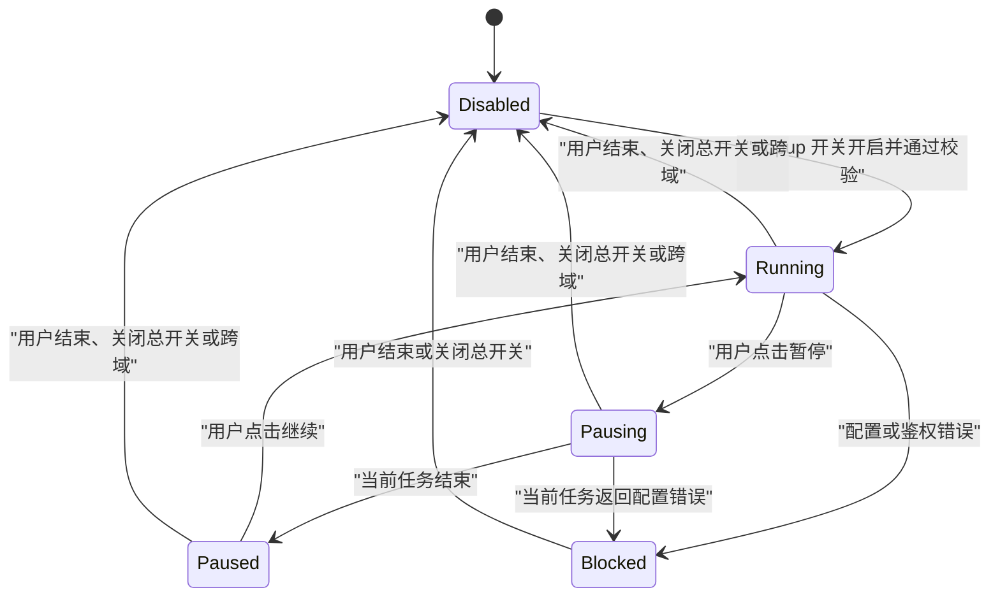
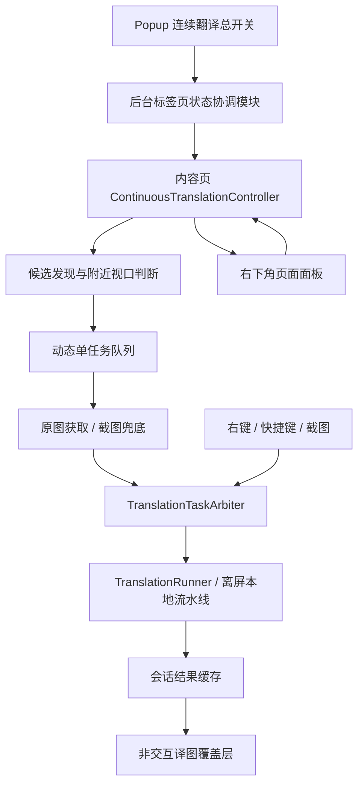

# 连续翻译模式设计

- 状态：已确认，待实现
- 日期：2026-07-25
- 文档类型：产品与技术设计
- 适用范围：Chrome / Edge 扩展内容页、Popup、后台脚本与本地翻译流水线

## 概述

连续翻译模式解决未专门适配的漫画网站必须逐张点击翻译的问题。用户从 Popup 为当前标签页主动开启后，扩展持续检测视口附近符合条件的 `/<picture>`，按照用户当前阅读位置自动完成图片获取、本地 OCR、文本翻译、去字、排版和译图覆盖。

连续翻译不是整页批处理，也不是永久的网站级自动开关。它是有明确开始、暂停、继续和结束语义的标签页会话。

## 已有实现与问题

当前内容页有两条图片翻译路径：

1. X、Pixiv、E-Hentai 通过 `SiteAdapter.findImages()` 发现专用目标，并为目标挂载单图按钮。
2. 通用网页的空适配器不发现图片，只支持右键、悬停快捷键和截图翻译。

Pixiv 阅读模式已有“翻译当前页 / 翻译全部”，但它：

- 依赖 Pixiv 专用页面结构；
- 串行遍历预先取得的全部 URL；
- 不随用户视口动态调整；
- 不能在执行中暂停或结束；
- 明确不支持 Nano Banana。

通用右键图片翻译会为每次操作创建临时浮层和临时状态键，同一原图重复出现时不能自然共享结果。当前浮层还为每个目标各自运行位置跟踪循环，不适合作为长页面多图方案。

连续翻译需要复用现有 `TranslationRunner`、站点原图解析和离屏流水线，但不能直接扩张现有单图控制器或 Pixiv 批量循环。

## 产品目标

- 用户只需打开一次当前标签页开关，即可随阅读进度连续翻译漫画图片。
- 优先完成用户正在看和即将看到的图片，不翻译用户没有浏览的整页内容。
- 不修改站点的 `src/srcset`，不破坏原有点击、翻页、缩放和懒加载行为。
- 严格控制本地流水线并发、后台标签页资源消耗和错误扩散。
- 通用网页与已适配站点共享同一套连续调度和页面交互。
- 保留右键、快捷键和截图翻译，并让手动操作优先于自动任务。

## 非目标

V1 不包含：

- CSS `background-image`；
- `<canvas>`、SVG、视频帧；
- Nano Banana 整图翻译；
- AI 漫画图片分类；
- 用户可配置的候选尺寸阈值；
- 多张本地流水线并行；
- 每张图片的常驻按钮或状态胶囊；
- “跳过当前图片”操作；
- 跨刷新的译图缓存；
- 网站级或全局永久自动开启；
- 对旋转、倾斜等复杂 CSS 变换的精确覆盖。

## 用户交互

### Popup 总开关

Popup 在品牌头部与“翻译设置”面板之间增加一行总开关：

```
连续翻译                                      [ 开关 ]
```

Popup 不提供暂停、继续、原图切换、队列详情或结束按钮。它只负责当前标签页的启用状态：

- 关闭 → 打开：校验配置，为当前标签页创建连续翻译会话；
- 打开 → 关闭：结束会话并移除页面面板，但保持页面当前显示原图或译图的状态；
- 页面处于暂停时，Popup 开关仍显示为打开；
- Popup 打开时从后台读取当前活动标签页状态，不依赖 Popup 自己保存 React 状态。

开关开启失败时自动回到关闭，并在开关下方显示一行原因。需要覆盖：

- Nano Banana 当前被选中；
- 翻译服务、模型、API Key 或登录状态不完整；
- 当前页面不能注入或联系内容脚本；
- 当前 URL 不支持内容脚本运行。

连续翻译开启后修改设置仍正常保存，但不改变当前会话。Popup 在设置区域显示：

> 连续翻译正在使用启动时配置；关闭并重新开启后生效。

### 页面控制面板

会话启动后立即在页面右下角显示固定的可折叠胶囊，距右侧和底部各 `16px`。即使当前没有候选图片，胶囊也显示“连续翻译中”，但不显示“等待图片出现”。

折叠状态：

| 会话状态 | 文案 |
| --- | --- |
| 运行且无候选 | 连续翻译中 |
| 运行且有候选 | 连续翻译中 · `完成数/附近候选数` |
| 请求暂停 | 完成当前图片后暂停 |
| 已暂停 | 已暂停 |
| 配置级错误 | 已暂停 · 配置错误 |

展开状态包含：

- 当前阶段；
- 已完成、处理中、等待、失败、跳过数量；
- 全局“译图 / 原图”切换；
- “暂停”或“继续”；
- “结束”；
- 有失败项时显示“重试失败项”；
- 最近一次错误摘要与可展开详情。

“结束”放在展开状态中，不弹确认框。

### 原图 / 译图切换

连续翻译显示模式是页面级状态，与任务运行状态相互独立：

- 切换到原图后，所有已完成图片立即隐藏译图覆盖层；
- 后续任务继续运行，新结果只保存，不自动覆盖原图；
- 切换回译图后，一次显示所有已完成结果；
- 暂停和结束都不改变显示模式；
- 结束后移除面板，保留当前显示状态和仍连接在页面中的结果；
- 再次从 Popup 开启时重新显示面板，并复用同一文档中仍保留的结果。

### 单图反馈

- 只有当前正在执行的自动图片在右上角显示很小的转圈动画；
- 不显示文字胶囊，不遮暗原图；
- 排队中的图片没有标记；
- 成功、跳过、失败或取消后都移除转圈；
- 失败信息只进入全局面板；
- 转圈遵循 `prefers-reduced-motion`。

### 暂停与结束

暂停：

- 立即停止发现和加入新任务；
- 已发现候选保留在会话中；
- 当前已开始的任务继续完成；
- 当前任务完成后进入已暂停状态；
- 已完成译图和面板继续保留；
- 继续时重新扫描页面，并按最新视口重建队列。

结束：

- 停止候选检测并清空等待队列；
- 通过 `AbortSignal` 尝试取消当前自动任务；
- 立即移除页面面板和单图转圈；
- 不改变连续翻译显示模式；
- 不移除仍连接图片上的已完成译图；
- 不影响右键、悬停快捷键或截图翻译。

若结束发生在不可取消的图片下载阶段，下载结果到达后必须被丢弃，不能重新启动流水线或更新 UI。

## 生命周期与状态

### 会话状态机



页面是否可见是调度门控，不是会话状态：

- 当前任务在页面进入后台后允许完成；
- 后台页面不启动新的自动任务；
- 页面重新可见后自动恢复调度；
- 这不会把会话显示为“暂停”。

连续翻译显示模式是另一条正交状态轴：

```ts
type ContinuousTranslationDisplayMode = 'original' | 'translated';
```

### 标签页范围

- 默认关闭；
- 状态属于当前标签页，不属于全局设置；
- 同源刷新和 SPA 路由变化保持开启或暂停状态；
- 导航到不同 origin 时后台清除状态；
- 关闭标签页时清除状态；
- 浏览器重启后不恢复；
- 刷新后保留启用状态和启动时配置快照，但不保留译图结果，页面重新检测和翻译。

后台使用 `chrome.storage.session` 保存按 `tabId` 索引的会话控制状态，以跨越 MV3 后台脚本休眠和同源刷新：

```ts
type ContinuousTranslationPhase = 'running' | 'pausing' | 'paused' | 'blocked';

type ContinuousTranslationTabState =
  | {
      enabled: false;
    }
  | {
      enabled: true;
      origin: string;
      phase: ContinuousTranslationPhase;
      activatedAt: number;
      settingsSnapshot: ExtensionSettings;
      blockingError?: string;
    };
```

`settingsSnapshot` 只保存在扩展的 session storage，不进入网页存储，也不写入诊断日志。API Key 的日志脱敏规则保持不变。

## 候选图片

### 支持的 DOM 目标

V1 只检测 `HTMLImageElement`。`<picture>` 通过其内部实际渲染的 `` 自然支持。

候选必须同时满足：

- 元素已连接到当前文档；
- 图片已加载，`naturalWidth/naturalHeight` 有效；
- 当前样式不是 `display:none` 或 `visibility:hidden`；
- 渲染宽度至少 `240px`；
- 渲染高度至少 `180px`；
- 渲染面积至少 `80,000px²`；
- 原始宽高至少有一边达到 `500px`；
- 元素不是 ShinobuTranslator 自己创建的 UI 或译图。

不限制长宽比，以免漏掉竖长 Webtoon 图片。

### 发现与视口范围

候选检测使用：

- `MutationObserver`：新增/移除节点，以及 `src`、`srcset`、`sizes`、`media` 变化；
- 捕获阶段 `load/error` 事件：处理懒加载完成；
- `IntersectionObserver`：判断是否进入视口附近；
- `ResizeObserver`：候选尺寸变化后重新判断资格。

附近视口使用上下各一个视口高度的预热区。这个范围是内部常量，不进入用户设置。

开启或继续时必须进行一次完整 `document.images` 扫描；之后只增量处理变化。暂停时断开候选发现观察器，继续时重新扫描，避免在暂停期间持续积累 DOM 事件。

### 离开视口

- 当前任务不因滚动离开而取消；
- 尚未开始且离开附近视口的图片退出执行队列；
- 候选身份仍保留；
- 图片再次进入附近视口时重新入队；
- 面板等待数量只统计当前附近视口内的任务。

### 身份与去重

图片身份以规范化后的原图 URL 为主，不以 DOM 元素实例为主：

- 同一 URL 在页面多处出现只翻译一次；
- 一个结果可以绑定到多个图片元素；
- 网站移除并重新创建元素时可以复用结果；
- 元素的来源 URL 改变时解除旧绑定，并作为新候选重新判断；
- 站点适配器可以提供更稳定的身份，例如 Pixiv 作品页码或 X 媒体身份。

## 图片来源与截图兜底

来源解析顺序：

1. 站点适配器提供的原图 URL 和稳定身份；
2. 最近的 `<a href>` 明确指向图片资源时使用链接地址；
3. 使用浏览器实际选择的 `img.currentSrc`；
4. 最后回退到 `img.src`。

不主动选择 `srcset` 中最大的未使用资源。

获取方式：

- `http/https` 使用现有后台图片下载模块；
- `data:` 和 `blob:` 在内容页可读取时转换为 `File`；
- 下载失败时允许对当前 `/<picture>` 使用可见标签页截图裁剪兜底。

截图兜底要求图片至少 `90%` 的渲染面积位于视口内。未达到时不记为最终失败，而进入“等待完整可见”状态；图片再次满足条件后重试获取。

截图期间必须临时隐藏：

- 连续翻译面板；
- 所有单图转圈；
- ShinobuTranslator 的译图覆盖层和其他浮层。

截图完成后的下一帧恢复原显示，避免把扩展 UI 或其他译图截进输入。

## 调度与优先级

### 自动任务

连续模式最多只有一个自动任务处于完整执行流程中，包括图片获取、OCR 流水线和结果提交。候选不会被批量提交到离屏流水线队列。

等待任务按下列信息动态排序：

1. 是否与当前视口相交；
2. 沿最近滚动方向到视口的距离；
3. 视觉位置从上到下、从左到右；
4. 首次进入附近视口的时间。

滚动或布局变化时只重排尚未开始的任务。

### 手动任务

右键图片、悬停快捷键、截图翻译和专用单图按钮属于手动任务：

- 手动任务不打断当前任务；
- 当前任务结束后，手动任务排在任何等待的自动任务之前；
- 手动任务不进入连续翻译面板计数；
- 手动目标与已完成连续结果拥有相同身份时直接复用结果。

为保证所有入口遵循同一优先级，引入共享的 `TranslationTaskArbiter` 深模块：

```ts
type TranslationTaskPriority = 'manual' | 'continuous';

interface TranslationTaskArbiter {
  run<T>(request: {
    owner: string;
    priority: TranslationTaskPriority;
    execute(signal: AbortSignal): Promise<T>;
  }): Promise<T>;

  cancelOwner(owner: string, reason: string): void;
}
```

它的 interface 只暴露“按优先级运行”和“取消某个 owner”两种能力；排队、稳定排序、取消传播和一次只运行一个任务都隐藏在 implementation 内。

现有 `ImageTranslationController`、`ScreenshotController`、`ReadingModeController` 和新的连续翻译模块都通过这个 seam 执行任务。离屏流水线的 FIFO 继续作为最终安全网，不再承担产品级优先级语义。

## 配置

### 启动校验

新增 `validateContinuousTranslationSettings(settings)`：

- 复用现有通用配置校验；
- 拒绝任何 Nano Banana 图像流水线；
- 校验当前文本翻译供应商所需的 Key、模型和认证状态；
- 返回面向用户的单一错误文案。

视觉模型仍在第一张任务运行时懒加载，不因开启开关而提前初始化。

### 配置快照

会话启动时冻结完整 `ExtensionSettings`：

- 后续所有自动任务使用同一快照；
- 同源刷新后仍使用该快照；
- 运行期间修改全局设置只影响手动任务和未来会话；
- 必须结束并重新开启连续翻译才能应用新设置；
- 已完成结果不会因设置变化自动重翻。

## 错误策略

| 错误类型 | 行为 |
| --- | --- |
| 未检测到文本 / OCR 无有效结果 | 记为跳过，继续下一张 |
| 用户结束导致取消 | 不计失败，不重试 |
| 页面进入后台 | 当前任务完成，之后门控新任务 |
| 临时网络错误、超时、限流 | 自动重试一次，仍失败则记录并继续 |
| 单张下载、解码或流水线错误 | 记录失败并继续 |
| API Key、鉴权、模型或配置错误 | 会话进入 `blocked`，停止新任务 |
| 截图兜底时图片不够可见 | 等待重新可见，不计失败 |

“重试失败项”只重置最终失败的图片，不重置已跳过图片。配置级错误不能通过继续按钮绕过；面板提示用户关闭总开关、修正设置后重新开启。

错误分类应优先使用结构化 `errorCode`，不能依赖中文文案包含关系。需要为下载、配置、鉴权、限流、取消和“未检测到文本”补齐稳定错误码。

## 译图覆盖层

### 展示原则

- 不修改原图 `src/srcset`；
- 覆盖层 `pointer-events: none`；
- 网站原有点击、右键、拖拽、缩放和触摸手势继续命中原元素；
- 复制原图的 `object-fit`、`object-position`、圆角和基本裁剪；
- 译图只在完整结果生成后一次显示，不逐阶段替换；
- 原图显示模式下只隐藏覆盖层，不释放结果。

### 几何跟踪

不能为每张图片启动独立永久 `requestAnimationFrame` 循环。覆盖层模块统一管理所有绑定：

- `ResizeObserver` 记录尺寸变化；
- 捕获滚动、窗口 resize 和 DOM 变化后，只调度一个共享的下一帧更新；
- 每帧批量读取 `getBoundingClientRect()`，再批量写入覆盖层样式；
- 元素断开或来源改变时解除绑定；
- 页面结束连续模式后，仅为仍显示的已完成译图保留轻量跟踪；
- 来源改变时必须移除旧覆盖，防止虚拟列表复用元素后显示错误译图。

复杂旋转、倾斜或三维 transform 在 V1 中不保证精确匹配；检测到明显非轴对齐变换时可以放弃自动覆盖并记录为不支持。

### 结果缓存

结果缓存属于当前文档会话：

- 与 DOM 连接的译图结果被固定，不因 LRU 淘汰；
- 已移除元素的结果进入临时 LRU；
- 临时 LRU 同时限制最多 `64` 项和约 `128 MiB`，先达到者触发淘汰；
- 淘汰时撤销 Object URL；
- 页面刷新、卸载或内容脚本销毁时释放全部结果；
- 结束连续翻译不清除仍连接且正在展示的结果。

这些阈值是 implementation 常量，不进入用户设置。

## 已适配站点

连续翻译也可在 X、Pixiv 和 E-Hentai 开启。

开启后：

- 隐藏现有专用单图按钮；
- 隐藏 Pixiv 阅读模式底部“翻译当前页 / 翻译全部”；
- 暂停期间继续隐藏；
- 结束后恢复原有专用 UI；
- 右键、悬停快捷键和截图翻译始终保留。

站点适配器不再拥有另一套连续调度器。它只为通用候选提供可选增强：

```ts
type ContinuousImageMetadata = {
  key?: string;
  originalUrl?: string;
  translationContext?: TranslationReferenceContext;
};

interface SiteAdapter {
  // existing members...
  getContinuousImageMetadata?(
    image: HTMLImageElement,
  ): ContinuousImageMetadata | null;
}
```

如果适配器不识别某个图片，连续模式仍使用通用来源解析。因此在 X 时间线或 Pixiv 页面中的其他大图仍可按通用规则成为候选。

`TranslatorCore` 增加专用 UI 抑制能力，但不承担连续模式内部状态：

```ts
interface SpecializedTranslationUi {
  setSuppressed(suppressed: boolean): void;
}
```

连续模式开始和暂停时 `suppressed = true`，结束时恢复为 `false`。

## 模块设计

### 外部 seam

新增 `ContinuousTranslationController` 深模块。内容页入口只需要同步后台状态、发送少量命令以及查询可复用结果：

```ts
type ContinuousTranslationCommand =
  | { type: 'pause' }
  | { type: 'resume' }
  | { type: 'end' }
  | { type: 'set-display'; mode: ContinuousTranslationDisplayMode }
  | { type: 'retry-failed' };

interface ContinuousTranslationController {
  reconcile(tabState: ContinuousTranslationTabState): Promise<void>;
  dispatch(command: ContinuousTranslationCommand): Promise<ContinuousTranslationSnapshot>;
  findReusableResult(sourceIdentity: string): TranslatedImageResult | null;
  dispose(): void;
}
```

这个 interface 隐藏：

- DOM 候选发现；
- 资格判断和来源解析；
- IntersectionObserver/ResizeObserver 生命周期；
- 队列排序；
- 页面可见性门控；
- 错误分类和重试；
- 配置快照；
- 结果缓存；
- 覆盖层几何跟踪；
- 页面面板渲染；
- 会话计数和状态转换。

删除该模块会迫使这些行为重新散落到内容页入口、现有单图控制器和各站点适配器中，因此它具备足够 depth。

### 内部文件建议

```text
src/content/continuousTranslation/
  index.ts                    外部 interface 与工厂
  controller.ts               会话状态机、调度与不变量
  candidates.ts               DOM 发现、资格与附近视口
  imageInput.ts               来源解析、下载与截图兜底
  overlays.ts                 覆盖层、转圈、几何跟踪与结果绑定
  panel.ts                    页面胶囊和展开面板
  errors.ts                   结构化错误分类
  resultCache.ts              连接固定与临时 LRU
```

这些是同一深模块的 internal seams，不应逐个暴露给内容页调用者。测试可以通过工厂注入观察器、时钟、图片获取和任务执行 adapter，但产品代码只依赖外部 interface。

### 后台标签页状态

```text
src/background/continuousTranslation/
  tabStateStore.ts            chrome.storage.session 的按 tab 状态
  coordinator.ts              活动标签页解析、校验、跨域与命令转发
```

后台 coordinator 是 Popup 和内容页共享的状态所有者：

- Popup 查询或修改当前活动标签页；
- 内容页启动时 bootstrap 当前 tab 状态；
- 内容页面板上报 pause/resume/end/blocked；
- `tabs.onUpdated` 检查跨域；
- `tabs.onRemoved` 清理状态。

### 共享消息

在 `src/shared/messages.ts` 增加：

```ts
type ContinuousTranslationRuntimeMessage =
  | { type: 'mt:continuous-translation-get' }
  | { type: 'mt:continuous-translation-set-enabled'; enabled: boolean }
  | { type: 'mt:continuous-translation-set-phase'; phase: ContinuousTranslationPhase }
  | { type: 'mt:continuous-translation-bootstrap' };

type ContinuousTranslationContentMessage = {
  type: 'mt:continuous-translation-sync';
  state: ContinuousTranslationTabState;
};
```

消息处理规则：

- Popup 没有 `sender.tab`，后台查询当前窗口活动标签页；
- 内容页有 `sender.tab`，后台只允许它读写自己的 tab；
- 启用时后台先保存状态，再向内容页同步；同步失败则回滚为关闭；
- 内容页加载时发送 bootstrap；
- bootstrap 发现 origin 不匹配时后台立即清除旧状态；
- 所有命令幂等，重复消息不产生重复观察器、面板或任务。

### 现有流水线调整

`PipelineRunFileOptions` 增加 `signal?: AbortSignal`，并向现有 `runLocalPipeline` 传递：

```ts
await this.runLocalPipeline(
  file,
  pipelineConfig,
  onProgress,
  { signal: options.signal },
);
```

本地离屏流水线已经支持按 job 取消；本次工作只需把 signal 从连续会话和任务仲裁模块贯通到现有 client。

## 页面执行流程



## 文件影响范围

| 文件或目录 | 变更 |
| --- | --- |
| `src/shared/messages.ts` | 连续模式消息与响应 |
| `src/shared/config.ts` | 连续模式专用配置校验，不增加持久化开关 |
| `apps/extension/src/capabilities/contracts.ts` | 补齐 session storage、tab 消息与原生交互的窄能力契约 |
| `apps/extension/src/background.ts` / `content.ts` | 目标组合根注入扩展能力，不在业务实现中探测浏览器全局 |
| `src/background/index.ts` | 注册连续模式状态协调与 tab 生命周期 |
| `src/background/messages/router.ts` | 路由 Popup/内容页连续模式消息 |
| `src/background/continuousTranslation/*` | 新增按 tab 状态与命令协调 |
| `src/popup/App.tsx` | 增加唯一总开关和配置快照提示 |
| `src/popup/styles.css` | 总开关样式与错误文案 |
| `src/content/index.ts` | 创建控制器、bootstrap、接收后台同步 |
| `src/content/continuousTranslation/*` | 新增连续翻译深模块 |
| `src/content/core/TranslatorCore.ts` | 抑制/恢复专用 UI，暴露共享结果与任务仲裁依赖 |
| `src/content/core/translation/translationRunner.ts` | 接收并传递取消 signal |
| `src/content/core/translation/localPipelineClient.ts` | 复用现有 signal/cancel，不改变协议语义 |
| `src/content/adapters/*.ts` | 可选连续候选元数据增强 |
| `src/content/core/ui.ts` | 复用品牌样式变量，避免复用单图按钮 DOM |

## 测试策略

### 深模块 interface 测试

以 `ContinuousTranslationController` interface 为测试面，不直接断言内部队列数组或观察器实现：

- reconcile 启用状态后创建一个面板且只创建一次；
- 初始符合条件并进入附近视口的图片触发一个任务；
- 多张候选永远只有一个自动任务执行；
- 滚动后尚未开始任务按新视口调整；
- 候选离开附近视口后不执行，回来后重新执行；
- 页面隐藏后不启动新任务，重新可见后继续；
- pause 等待当前任务完成，resume 重新扫描；
- end 取消 owner、移除面板并保持显示模式；
- original 模式下新结果不显示，translated 模式下统一显示；
- 配置错误进入 blocked，单图错误继续；
- retry-failed 不重试 skipped；
- 同一 URL 多元素只执行一次；
- 来源改变不会保留旧覆盖；
- 重复 reconcile/command 幂等。

### 任务仲裁测试

- 手动任务排在等待的连续任务前；
- 手动任务不打断当前任务；
- `cancelOwner` 只取消指定 owner；
- 取消向执行函数的 signal 传播；
- 同优先级保持稳定顺序。

### 后台状态测试

- Popup 查询解析当前活动标签页；
- 内容页只能修改自己的 tab；
- 启用前执行配置校验；
- Nano Banana 被拒绝；
- 同源刷新 bootstrap 恢复状态与配置快照；
- 跨域清除；
- tab 关闭清除；
- 内容页同步失败时启用回滚；
- paused 状态下 Popup 总开关仍为开启。

### DOM 与覆盖层测试

- `<picture>` 使用内部 `.currentSrc`；
- 尺寸阈值边界；
- MutationObserver 发现懒加载图片；
- ResizeObserver 使图片从不合格变为合格；
- 覆盖层 `pointer-events:none`；
- 滚动/resize 后覆盖层批量更新；
- active 图片只有转圈，没有文字；
- ended 状态来源变化时移除陈旧覆盖；
- LRU 不淘汰仍连接图片。

### 浏览器 smoke

新增本地测试页，覆盖：

1. 初始两张大图和若干头像/横幅；
2. 滚动后懒加载新图片；
3. `<picture>` 与 `srcset`；
4. 同 URL 重复图片；
5. 虚拟列表移除并重新创建图片；
6. 原图下载失败后的截图兜底；
7. 页面隐藏/恢复；
8. 同源 history 路由；
9. 原图/译图切换；
10. 暂停、继续和结束。

## 验收标准

1. 默认不扫描或翻译任何图片。
2. Popup 只有一个连续翻译总开关。
3. 开关只影响当前标签页。
4. Nano Banana 模式无法开启，并显示明确原因。
5. 开启后立即出现右下角胶囊；没有图片时只显示“连续翻译中”。
6. 只有符合固定尺寸规则的 `/<picture>` 可成为候选。
7. 只有视口附近候选进入执行队列。
8. 自动任务完整流程并发数始终为一。
9. 用户快速滚动不会留下历史自动任务积压。
10. 页面进入后台后不启动新自动任务。
11. 手动任务在当前任务结束后优先执行。
12. 当前自动图片只显示右上角小转圈。
13. 译图不修改原图来源，也不拦截网站交互。
14. 全局原图/译图切换不暂停任务。
15. 暂停完成当前任务后停止，并保留面板和结果。
16. 结束移除面板、尝试取消当前任务，但不改变原图/译图显示状态。
17. 单图失败不会阻塞下一张；配置级错误会暂停会话。
18. 同一原图 URL 不重复翻译。
19. 已适配站点开启连续模式时隐藏专用按钮，结束后恢复。
20. 同源刷新继续开启但重新翻译；跨域后自动关闭。
21. 运行中修改设置不影响当前会话，重启后生效。
22. 页面卸载后释放所有 Object URL、观察器和事件监听器。

## 实施顺序

1. 共享状态类型、消息协议和后台 tab 状态协调；
2. Popup 总开关、启动校验和内容页 bootstrap；
3. `TranslationTaskArbiter` 与取消 signal 贯通；
4. 连续翻译控制器、候选发现和单任务调度；
5. 结果缓存、覆盖层和单图转圈；
6. 页面胶囊、暂停/继续/结束与显示模式；
7. 已适配站点 UI 接管和元数据增强；
8. 截图兜底、结构化错误与失败重试；
9. interface 测试、DOM 测试和浏览器 smoke。
